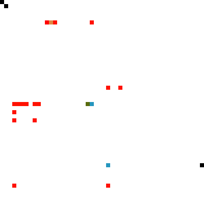

# open-place

This is a github based canvas, you can make pixels by creating issues!

## Usage
* Create an issue with the following title format:
`/set <x> <y> <color>`
Example:
`/set 12 5 #ff1201`
This will set the pixel at (12,5) to the color #ff1201 (red). 
* body can be empty.

## TO-DO
- [ ] A cron or trigger job to reset the canvas
- [ ] Grid with numbers
- [ ] Web interface with a better renderer
- [ ] Prevent worker colisions (for lack of a better word
- [ ] replace hex values for a predefined palette (colors)

## Contributing
...
